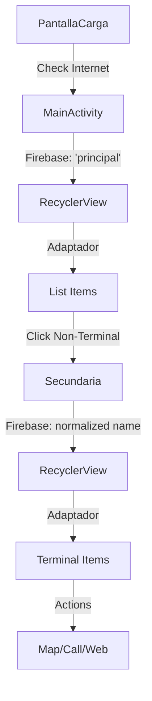

## Architecture Pattern

HuelvaPedia follows a **classic Android MVC (Model-View-Controller)** architecture pattern with Firebase Realtime Database as the backend:

- **Model**: `Elementos` class representing encyclopedia entries
- **View**: XML layouts with RecyclerView for list display
- **Controller**: Activities (`MainActivity`, `Secundaria`) and `Adaptador` (RecyclerView Adapter)

## Application Flow

The app implements a hierarchical navigation pattern with real-time data synchronization:



<Tabs>
  <Tab title="Entry Point">
    **PantallaCarga** (Splash Screen)
    - Checks internet connectivity
    - Displays loading animation
    - Navigates to MainActivity after 5 seconds
  </Tab>
  
  <Tab title="Main Screen">
    **MainActivity** (Main Activity)
    - Loads top-level categories from Firebase 'principal' node
    - Displays RecyclerView with categories
    - Provides weather button
  </Tab>
  
  <Tab title="Detail Screen">
    **Secundaria** (Secondary Activity)
    - Receives category name from Intent
    - Normalizes name (lowercase, no spaces)
    - Loads subcategories from Firebase
    - Can navigate deeper or show terminal items
  </Tab>
</Tabs>

## Core Components

### Activities

HuelvaPedia uses two main Activities for navigation:

<CodeGroup>
```java MainActivity.java:48
reference = FirebaseDatabase.getInstance().getReference().child("principal");

reference.addValueEventListener(new ValueEventListener()
{
    @Override
    public void onDataChange(@NonNull DataSnapshot snapshot)
    {
        listaElementos.clear(); // Evita duplicación de datos cuando Firebase notifica cambios
        for (DataSnapshot dataSnapshot : snapshot.getChildren())
        {
            Elementos elemento = dataSnapshot.getValue(Elementos.class);
            listaElementos.add(elemento);
        }
        adaptador = new Adaptador(MainActivity.this, listaElementos);
        recyclerView.setAdapter(adaptador);
    }
});
```

```java Secundaria.java:49
// Recibe el nombre del tema anterior y lo normaliza para buscar su referencia en Firebase
Intent intent = getIntent();
String nombreReferencia = intent.getStringExtra("Nombre")
        .replace(" ", "")
        .toLowerCase();

reference = FirebaseDatabase.getInstance().getReference().child(nombreReferencia);
```
</CodeGroup>

<Info>
Both Activities share the same layout (`activity_main.xml`) but Secundaria hides the weather button by setting its visibility to GONE.
</Info>

### RecyclerView Pattern

The app uses RecyclerView for efficient list display with the `Adaptador` class:

```java Adaptador.java:26
public Adaptador(Context context, ArrayList<Elementos> elementos)
{
    this.context = context;
    this.elementos = elementos;
}

@Override
public void onBindViewHolder(@NonNull MiViewHolder holder, int position)
{
    Elementos elemento = elementos.get(position);
    
    holder.nombre.setText(elemento.getNombre());
    holder.descripcion.setText(elemento.getDescripcion());
    Picasso.get().load(elemento.getFoto()).into(holder.imagen);
    
    // Conditional logic based on ultimo field...
}
```

### ViewHolder Pattern

The `MiViewHolder` static inner class implements the ViewHolder pattern:

```java Adaptador.java:135
static class MiViewHolder extends RecyclerView.ViewHolder
{
    TextView nombre, descripcion;
    ImageView imagen;
    Button botonUbicacion, botonLlamar, botonEnlace;

    public MiViewHolder(@NonNull View itemView)
    {
        super(itemView);
        nombre = itemView.findViewById(R.id.tenombre);
        descripcion = itemView.findViewById(R.id.tedescri);
        imagen = itemView.findViewById(R.id.imagen);
        botonUbicacion = itemView.findViewById(R.id.botonubi);
        botonLlamar = itemView.findViewById(R.id.botonllamar);
        botonEnlace = itemView.findViewById(R.id.botonwiki);
    }
}
```

## Navigation Logic

The app uses a boolean field `ultimo` to determine navigation behavior:

<Accordion title="Non-Terminal Items (ultimo = false)">
Items that have subcategories. Clicking navigates to `Secundaria` Activity with the item name:

```java Adaptador.java:54
if (!elemento.getUltimo()) // Si no es el último, se navega a la Activity Secundaria
{
    holder.botonUbicacion.setVisibility(View.GONE);
    holder.botonLlamar.setVisibility(View.GONE);
    holder.botonEnlace.setVisibility(View.GONE);

    if (!tieneUbicacion && !tieneTelefono && !tieneEnlace)
    {
        holder.itemView.setOnClickListener(v -> {
            Intent intent = new Intent(v.getContext(), Secundaria.class);
            intent.putExtra("Nombre", elemento.getNombre());
            v.getContext().startActivity(intent);
        });
    }
}
```
</Accordion>

<Accordion title="Terminal Items (ultimo = true)">
Final items that display action buttons (map, call, web) instead of navigating deeper:

```java Adaptador.java:69
else // Es el último elemento, solo permite pulsar botones de acción
{
    // Botón de ubicación (mapa)
    if (tieneUbicacion)
    {
        holder.botonUbicacion.setOnClickListener(v -> {
            Intent intent = new Intent(Intent.ACTION_VIEW);
            intent.setData(Uri.parse(elemento.getUbicacion1() + Uri.encode(elemento.getUbicacion2())));
            Intent chooser = Intent.createChooser(intent, "Launch Maps");
            v.getContext().startActivity(chooser);
        });
    }
    // Similar logic for phone and web buttons...
}
```
</Accordion>

## Key Design Patterns

<CardGroup cols={2}>
  <Card title="Observer Pattern" icon="bell">
    Firebase ValueEventListener observes real-time database changes
  </Card>
  
  <Card title="Adapter Pattern" icon="plug">
    Adaptador bridges RecyclerView with ArrayList&lt;Elementos&gt;
  </Card>
  
  <Card title="ViewHolder Pattern" icon="box">
    MiViewHolder caches view references for performance
  </Card>
  
  <Card title="Intent Pattern" icon="arrow-right">
    Activities communicate via Intent extras
  </Card>
</CardGroup>

## Image Loading

The app uses **Picasso** library for efficient image loading from URLs:

```java Adaptador.java:48
Picasso.get().load(elemento.getFoto()).into(holder.imagen);
```

<Note>
Picasso handles image caching, resizing, and error handling automatically.
</Note>

## Thread Safety

Firebase listeners run on background threads and update the UI on the main thread automatically. The adapter refreshes the RecyclerView when new data arrives:

```java MainActivity.java:55
listaElementos.clear(); // Evita duplicación de datos cuando Firebase notifica cambios
for (DataSnapshot dataSnapshot : snapshot.getChildren())
{
    Elementos elemento = dataSnapshot.getValue(Elementos.class);
    listaElementos.add(elemento);
}
adaptador = new Adaptador(MainActivity.this, listaElementos);
recyclerView.setAdapter(adaptador);
```
